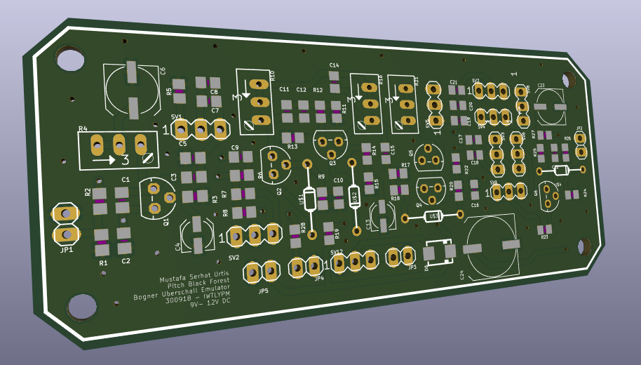
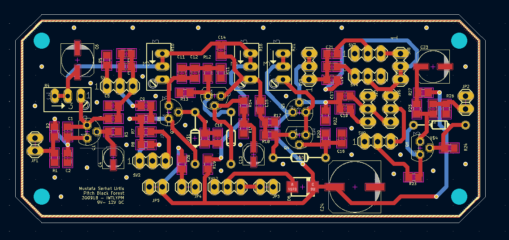

 

  

<h3 align="center">PITCH BLACK FOREST</h3>

  

    A Preamp Inspired By Ueberschall
  

<!-- WHAT -->
## What?

This is a two stage guitar preamp board with gain, treble, mid, bass, voicing, filter bands and volume controls. And a boost switch.

## Why?

Because I wanted to experiment with JFETs and also have a small preamp board that I was going to use on another project.

## How?

This is imported from Eagle to KiCad 6 while I was backing up my projects. So the schematic's look is a bit janky.
